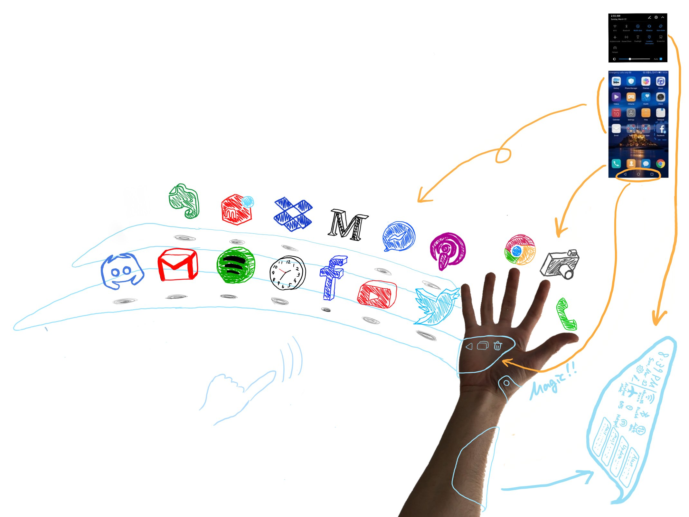

# Virtual Wearable

Here is one of my virtual wearable prototypes.
Until we have a very accurate BMI, we need a user interface in XR. However, existing AR/VR UI designs are often influenced by rectangular displays, which are not cool to me, so I made them in a sci-fi style and made them open source.

The next step is to create a generative AI agent that generates 3D scenes using the Unity engine and release it as an SDK as OSS. Now I want to learn about ML. Let me know if you have any ideas! 
Also, let me know what UI or OS you would like to see in the near future on the Issues tab or on [my Twitter](https://twitter.com/supertask_jp).

[YouTube](https://www.youtube.com/watch?v=xHunXGHA9lE)

## Requirements

- [Leap Motion Controller](https://www.ultraleap.com/product/leap-motion-controller/)
- [ULTRALEAP’S FIFTH GENERATION HAND TRACKING SOFTWARE, Software Version = v5.3.1-0d83c9b8](https://developer.leapmotion.com/tracking-software-download)
  - Don't install the wrong version
- WebCam (w = 640px, h = 480px)
  - I use [Brio 4K Pro Webcam](https://www.amazon.co.jp/-/en/960-001105-Brio-4K-Pro-Webcam/dp/B01N5UOYC4). But if anything is fine.
- Vuforia Engine 10.3.2
  - Download [com.ptc.vuforia.engine-10.3.2.tgz](https://drive.google.com/file/d/1j_KIdu9toXJEU4kqO4B1isp6IeAvuRhe/view?usp=sharing) and put it in ./Packages/ folder.

## How to run

- Install middlewares I wrote in Requiredments.
- Download [AR maker](./doc/images/PtcMaker20cm_scaled.jpg) and print it as 20cm wide.
- Run Unity!

## The first design

